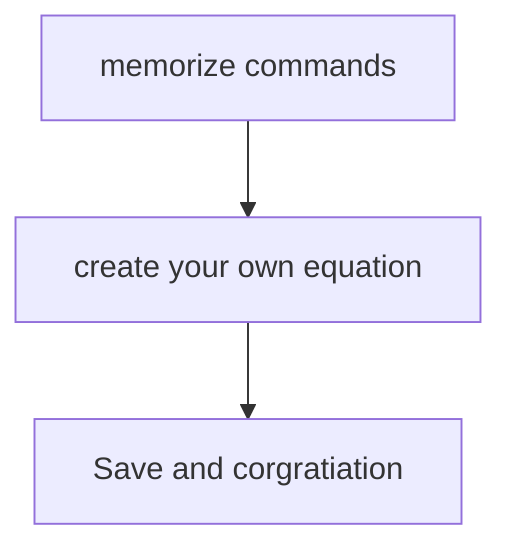

# LATEX FROM SCRATCH 
*Written by mohamed boukerche*

If you are interesting in writing math equations like this 

$$\int_ {1}^{2}{(x^2+16x)dx}$$

Or like this 

$$\sum_{i = 0}^{16}{15x}$$

$$
\sum_{i=1}^{n} i = \frac{n(n+1)}{2} \quad \prod_{i=1}^{n} i = n!
$$

# Start from Scratch :)
## You should memorize those commands to learn LATEX

### Special Characters
 Fractions: `\frac{a}{b}` → $\frac{a}{b}$
 
 Square root: `\sqrt{x}` → $\sqrt{x}$
 
 Exponents: `x^2` → $x^2$
 
 Subscripts: `x_i` → $x_i$
 
  Sum: `\sum_{i=1}^n` → $\sum_{i=1}^n$
  
 Integral: `\int_a^b` → $\int_a^b$

| Code | Example|
|------|--------|
|`\frac`|$$\frac{x}{15}$$|
|`\sqrt`|$$\sqrt{150}$$|
|`\sum`|$$\sum_{i = 0}^{16}{i^2}$$|
|`5^2`|$$5^2$$|
|`x_2`|$$x_2$$|
|`\boxed{x}`|$$\boxed{x}$$ box|
|`\int(x)dx`|$$\int_ {1}^{2}{(x^2+16x)dx}$$|
|`\ln(x)`|$$\ln(x)$$|

---

